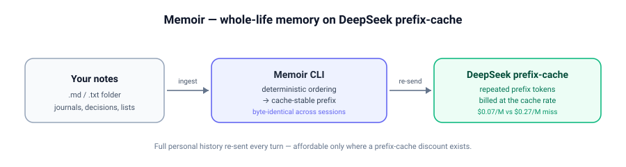

**English** | [简体中文](./README.zh-CN.md)

# Memoir

> Consumer AI that remembers your whole life — affordable on DeepSeek prefix-cache.

Your personal AI keeps forgetting because re-sending your full history every turn
is too expensive on OpenAI/Claude. Memoir assembles your notes into a
**cache-stable personal-history prefix** and re-sends that full prefix to the
DeepSeek API each turn, where the prefix-cache discount makes whole-life recall
cost cents per turn instead of dollars.

<picture>
  <source media="(prefers-color-scheme: dark)" srcset="./assets/flow-dark.svg">
  
</picture>

## Demo

Real output from `examples/notes` (4 small notes). Reproduce it with the
Quick Start below — `ingest` and `cost` run fully offline; `chat` needs a
DeepSeek API key.

```
$ memoir ingest examples/notes
             Ingested 4 note(s)
┏━━━━━━━━━━━━━━━━━━━━━━┳━━━━━━━━━━┳━━━━━━━━┓
┃ Source               ┃ Kind     ┃ Tokens ┃
┡━━━━━━━━━━━━━━━━━━━━━━╇━━━━━━━━━━╇━━━━━━━━┩
│ 2024-goals.md        │ markdown │     44 │
│ decision-deepseek.md │ markdown │    118 │
│ reading-list.md      │ markdown │     72 │
│ training.txt         │ text     │     82 │
└──────────────────────┴──────────┴────────┘

Prefix assembled. tokens=346  sources=4  hash=7dfc31cffa444112  cache_stable=True

$ memoir cost
         Per-turn cost — prefix 346 tokens, ~300 output tokens
┏━━━━━━━━━━━━━━━┳━━━━━━━━━━━━━━━━━━━━━━━━━━━━━━━━━━━━━━━━━━┳━━━━━━━━━━┓
┃ Provider      ┃ Assumption                               ┃ Per turn ┃
┡━━━━━━━━━━━━━━━╇━━━━━━━━━━━━━━━━━━━━━━━━━━━━━━━━━━━━━━━━━━╇━━━━━━━━━━┩
│ DeepSeek      │ cache hit (steady state) — deepseek-chat │  $0.0004 │
│ DeepSeek      │ cache miss (first turn)                  │  $0.0004 │
│ OpenAI gpt-4o │ no prompt caching                        │  $0.0039 │
│ OpenAI gpt-4o │ with prompt caching (~50% off cached)    │  $0.0034 │
└───────────────┴──────────────────────────────────────────┴──────────┘
Savings: OpenAI no-cache minus DeepSeek steady-state = $0.0035/turn (11x cheaper on DeepSeek)
```

The prefix is byte-identical across runs (verified with `shasum` after a re-ingest),
which is the cache-stability property that triggers DeepSeek's prefix-cache discount.

```
$ export DEEPSEEK_API_KEY=sk-...
$ memoir chat
Memoir chat — model deepseek-chat, prefix loaded. Type your question; Ctrl-D or 'exit' to quit.

you> Which books changed how I work, and what pace do I need to break 2:00?
memoir> The Mom Test changed how you interview users. You need 5:40/km for 21k to break 2:00; you're at 5:45/km now.
DeepSeek prefix-cache: $0.0004/turn  OpenAI equivalent: $0.0039/turn
```

(The chat turn above is illustrative of the shipped `memoir chat` flow; it needs a
live `DEEPSEEK_API_KEY`. The cost line is computed from the real `usage` returned
by the API, using the same rates as `memoir cost`.)

## Install

Requires Python 3.12+.

```bash
# from source (clone)
git clone https://github.com/SuperMarioYL/memoir.git
cd memoir
uv pip install -e .        # or: pip install -e .

# or, once published, a one-liner
uv tool install memoir     # or: pipx install memoir
```

Set your DeepSeek API key (get one at <https://platform.deepseek.com>):

```bash
export DEEPSEEK_API_KEY=sk-...
```

## Quick Start

```bash
# 1. point Memoir at any folder of .md / .txt notes
memoir ingest ~/Notes

# 2. see the dollar comparison for your actual prefix
memoir cost

# 3. chat with an AI that has read everything you've ever written
memoir chat
```

Other commands:

```bash
memoir status        # manifest + session summary
memoir chat --reset  # start a fresh conversation (prefix is untouched)
```

State lives under `~/.memoir/` (`prefix.txt`, `manifest.yaml`, `session.json`).
Override the location with `MEMOIR_HOME=/some/dir`. Override the model with
`DEEPSEEK_MODEL=deepseek-chat` and the base URL with
`DEEPSEEK_BASE_URL=https://api.deepseek.com`.

## How It Works

### The new primitive: a cache-stable personal-history prefix

State is the model's enemy: across sessions the model is stateless, so to recall
your whole life you must **re-send the full personal history every turn**. On
per-token pricing that is ruinous, which is why every shipped personal-AI product
(ChatGPT Memory, Claude Projects) defaults to summarization or RAG retrieval —
trading recall fidelity for affordability.

DeepSeek's prefix cache discounts repeated prefix tokens. Memoir turns that into
a consumer primitive: it assembles your notes into a deterministically ordered
prefix that is **byte-identical across sessions**, so the same prefix lands in
DeepSeek's cache and is billed at the cache rate on every turn after the first.

It is not RAG (no retrieval, no embeddings) and not summarization (your history
is sent verbatim).

### On-disk layout

```
~/.memoir/
├── prefix.txt        # assembled, ordered personal history
├── manifest.yaml     # source_count, total_tokens, prefix_hash, cache_stable, sources[]
└── session.json      # current conversation turns
```

### Why the prefix is "cache-stable"

- **Deterministic ordering** — sources are sorted by `(relative path, content_hash)`,
  so the assembled prefix is byte-identical regardless of filesystem walk order or
  the machine it runs on.
- **Stable framing** — every source is wrapped in the same header markers, so the
  prefix text never shifts when a note's body changes length.
- **Verified at ingest** — `cache_stable=True` means re-sorting and re-assembling
  produced a byte-identical prefix. If a future change broke determinism, this flag
  would flip and the cache discount would silently stop applying.

### Architecture

Single Python process. `ingest.py` reads the notes folder; `prefix.py` assembles the
cache-stable prefix and writes the manifest; `session.py` manages turns;
`deepseek_client.py` sends `prefix + turns` to DeepSeek and parses the cache-hit
`usage`; `cost.py` computes the OpenAI-equivalent cost for the same turn; `cli.py`
ties it together. No microservices, no daemon, no separate inference server.

### What is deliberately out of scope for v0.1

- CLI only — no web/desktop GUI.
- DeepSeek only — no multi-model support.
- Local folder only — no Notion/Apple Notes API auto-sync.
- Full-context only — no vector search / RAG fallback.
- No conversation folding (turns are not appended back into the persistent prefix).
- No encryption at rest.

## Pricing

Memoir is free and open source. You pay DeepSeek directly for inference with your
own API key. The rates below are the published pricing snapshot Memoir computes
against (2026-09; re-check the provider pages before quoting).

| Provider | Input (cache miss) | Input (cache hit) | Output | Source |
|---|---|---|---|---|
| DeepSeek `deepseek-chat` (V3) | $0.27 / 1M | **$0.07 / 1M** | $1.10 / 1M | [DeepSeek pricing](https://api-docs.deepseek.com/quick_start/pricing) |
| OpenAI `gpt-4o` | $2.50 / 1M | $1.25 / 1M (prompt cache, ~50% off) | $10.00 / 1M | [OpenAI pricing](https://openai.com/api/pricing/) |

**Worked example — a 20,000-token lifelong prefix, 300-token replies.** This is an
illustration using the rates above, not a measured benchmark. Your real numbers
come from `memoir cost` against your actual prefix.

| Per turn | DeepSeek (cache hit) | DeepSeek (cache miss, 1st turn) | OpenAI (no cache) | OpenAI (prompt cache) |
|---|---|---|---|---|
| Cost | **~$0.0017** | ~$0.0057 | ~$0.053 | ~$0.028 |

At ~200 turns/month on a 20k-token prefix, DeepSeek steady-state runs roughly
**$0.35/month** in API cost — the reason whole-life memory is finally affordable.
The same usage on GPT-4o without caching is ~$10.60/month, and even with OpenAI's
prompt caching ~$5.60/month (assuming the cache survives between turns, which for
intermittent consumer use it often does not).

**Future: Memoir Cloud.** The OSS CLI is free and runs locally with your own key.
A future hosted tier (~$12/month) would manage the prefix, pool API costs, and
remove the need to touch an API key or terminal — a natural SaaS layer on the OSS
core, not vaporware. v0.1 ships only the CLI.

## FAQ

**Isn't this just ChatGPT Memory with a cheaper model?**
No. ChatGPT Memory summarizes and RAG-retrieves fragments; Memoir re-sends your
full personal history every turn for whole-context recall. The cost difference is
structural — only a prefix-cache discount makes full-context re-send affordable.

**Why not just use RAG over my notes?**
RAG retrieves fragments and loses cross-note synthesis. Ask "what did I decide
about X across all my notes" and RAG may miss the pattern. Memoir sends
everything, every turn.

**Sending all my personal data to DeepSeek is a privacy risk.**
A real tradeoff. v0.1 assembles the prefix locally and uses your own API key —
notes leave your machine for inference only, not for storage. Encryption at rest
and local-model support are v0.2.

**What if OpenAI/Anthropic adds prefix-cache discounts?**
The cost advantage narrows, but Memoir owns the consumer brand and the
personal-history ingestion UX. The cost primitive is the entry wedge, not the
only moat.

**Why not just use DeepSeek directly?**
DeepSeek's API does not assemble your personal notes into a cache-stable prefix
or manage the re-send-every-turn pattern. Memoir is the consumer layer on top of
the primitive.

**Are the token counts exact?**
At ingest time Memoir uses `tiktoken` (`cl100k_base`) as an estimate for the
manifest. During `chat`, the DeepSeek API returns authoritative `usage` counts
(including `prompt_cache_hit_tokens` / `prompt_cache_miss_tokens`), and those
drive the printed cost line.

## Contributing

This is a v0.1 CLI with an intentionally narrow scope. Bug reports and small
fixes are welcome. Larger features (GUI, multi-model, conversation folding,
encryption, managed tier) are out of scope for v0.1 — please open an issue to
discuss before a large PR.

```bash
git clone https://github.com/SuperMarioYL/memoir.git
cd memoir
uv pip install -e .
pytest -q
```

## License

MIT — Copyright (c) 2026 SuperMarioYL. See [LICENSE](./LICENSE).
