[English](./README.md) · [Website](https://memoir.lei6393.com) · [GitHub](https://github.com/SuperMarioYL/memoir)

<picture>
  <source media="(max-width: 600px) and (prefers-color-scheme: dark)" srcset="./assets/presentation/hero-mobile-dark.svg">
  <source media="(max-width: 600px)" srcset="./assets/presentation/hero-mobile-light.svg">
  <source media="(prefers-color-scheme: dark)" srcset="./assets/presentation/hero-dark.svg">
  
</picture>

# memoir

**让笔记以稳定前缀进入每次对话。**

Memoir 读取本地文本笔记并生成确定性前缀，也可将该前缀与对话轮次发送给配置的 DeepSeek 兼容端点。

## 为什么需要它

如果每次会话都以不同方式拼接笔记，个人资料就难以复用。保留有序前缀与来源清单，可以检查实际要提供给模型的内容。

- **检查全部来源** — 清单记录实际拼接的来源。
- **确定性前缀** — 遍历顺序不改变拼接字节。
- **本地准备** — 导入与前缀拼接无需聊天请求。

## 架构

<picture>
  <source media="(max-width: 600px) and (prefers-color-scheme: dark)" srcset="./assets/presentation/architecture-mobile-dark.svg">
  <source media="(max-width: 600px)" srcset="./assets/presentation/architecture-mobile-light.svg">
  <source media="(prefers-color-scheme: dark)" srcset="./assets/presentation/architecture-dark.svg">
  
</picture>

ingest 遍历支持的笔记文件并计算内容哈希；prefix 按相对路径和哈希排序，以稳定边界拼接并记录清单。session 保存对话轮次；chat 时 deepseek_client 发送完整前缀与轮次。

| 组件 | 职责 |
| --- | --- |
| `Note ingestion` | memoir/ingest.py |
| `Stable prefix` | memoir/prefix.py |
| `Session state` | memoir/session.py |
| `Chat client` | memoir/deepseek_client.py |

## 安装与快速上手

使用仓库清单指定的运行时版本构建，并在仓库根目录运行示例。

```bash
git clone https://github.com/SuperMarioYL/memoir.git
cd memoir
uv venv .venv
uv pip install --python .venv/bin/python -e .
source .venv/bin/activate
```

仅拼接随仓四份示例笔记，反转输入顺序后比较生成的前缀字节。

```bash
.venv/bin/python examples/presentation-demo.py
```

## 实际运行示例

<picture>
  <source media="(max-width: 600px) and (prefers-color-scheme: dark)" srcset="./assets/presentation/process-mobile-dark.svg">
  <source media="(max-width: 600px)" srcset="./assets/presentation/process-mobile-light.svg">
  <source media="(prefers-color-scheme: dark)" srcset="./assets/presentation/process-dark.svg">
  
</picture>

The two assemblies produce identical prefix bytes and the same content hash.

```text
{
  "sources": 4,
  "ordered_paths": [
    "2024-goals.md",
    "decision-deepseek.md",
    "reading-list.md",
    "training.txt"
  ],
  "prefix_hash": "7dfc31cffa444112",
  "same_bytes_after_input_reversal": true,
  "cache_stable": true
}
```

完整命令与输出保存在 [docs/demo-results.json](./docs/demo-results.json). 输入和复现代码均随仓提供。

## 用法

CLI 提供以下操作。示例之外的命令需要替换成你的文件路径或标识。

```bash
memoir ingest examples/notes
memoir status
# Online chat requires your configured endpoint and API key:
memoir chat
```

## 配置

MEMOIR_HOME 指定 prefix.txt、manifest.yaml 与 session.json 的存储位置。DEEPSEEK_API_KEY 用于 chat；DEEPSEEK_MODEL 与 DEEPSEEK_BASE_URL 指定模型和端点。cost 命令使用仓库内价格快照，可能与当前实际计费不同。

## 集成与职责分工

<picture>
  <source media="(max-width: 600px) and (prefers-color-scheme: dark)" srcset="./assets/presentation/integrations-mobile-dark.svg">
  <source media="(max-width: 600px)" srcset="./assets/presentation/integrations-mobile-light.svg">
  <source media="(prefers-color-scheme: dark)" srcset="./assets/presentation/integrations-dark.svg">
  
</picture>

以下路径已有源码实现。按任务选择输入，并把生成的结果与项目一起保存。

| 路径 | 已实现职责 |
| --- | --- |
| Markdown / text | Local source notes |
| Prefix + manifest | Deterministic assembled input |
| DeepSeek HTTP | Configured online chat route |
| Session JSON | Saved conversation turns |

## 限制与后续方向

- 字节稳定不保证提供方缓存命中或具体费用；示例不调用 API。
- 在线 chat 会把已导入的完整笔记内容发送给配置端点，使用前应检查来源目录。
- token 数是估计值，完整前缀聊天仍受所选模型上下文窗口限制。

提供方缓存行为、大笔记上下文限制和回忆质量需要单独在线评估；这里不宣称实测节省或无限记忆。

## 许可与贡献

许可见 [LICENSE](./LICENSE). 反馈问题时请提供最小输入、执行命令和实际输出。
